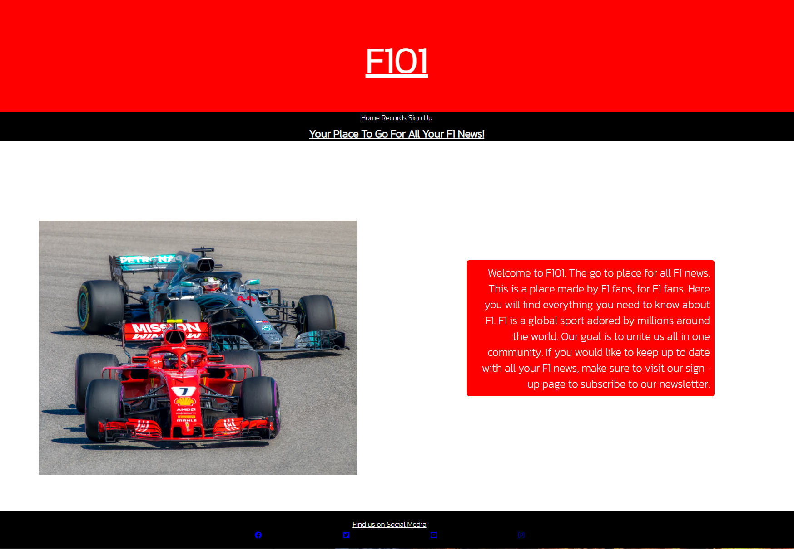
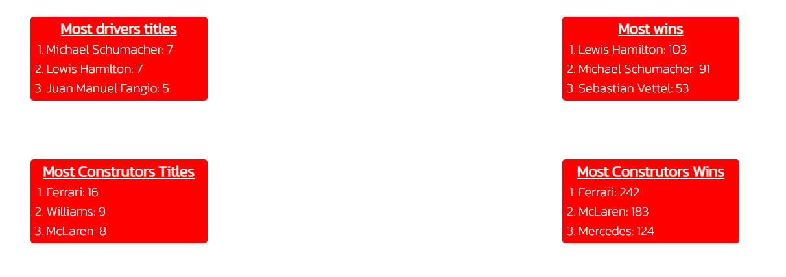
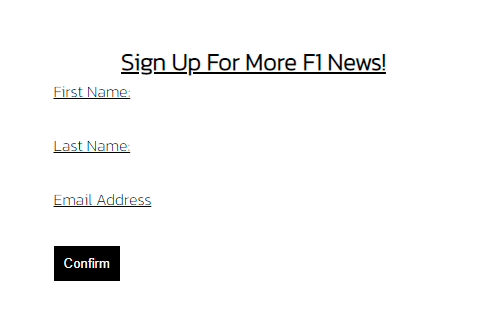
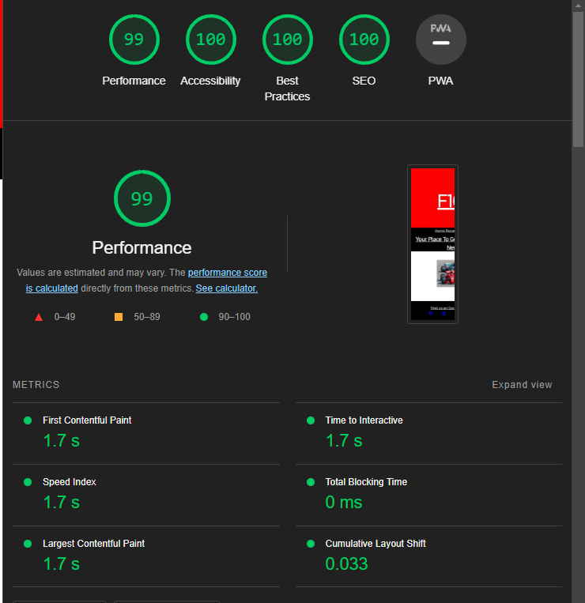
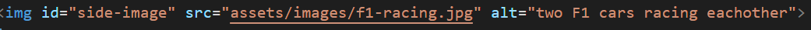

This website is a basis for an informative F1 website. It's purpose is to provide your typical F1 Fan with info about the sport as well a way to access more if wanted via email sign-up.

Features
- Navigaion: 
The top of the body of the website contains 3 navigation links to other pages of the website. It is ment to provide a simple way for the user to get to the info they want and is available on all pages.

- Records: 
The records page sets out 4 of the most impressive records currently standing in F1. It provides them in individual boxes so the consumer can see each one clearly.

- Signup: 
The signup page collects basic info from the user (Name and email address), to sign the user up for a newsletter. That way, the user can gain access to more info if they want to.

Testing:

- I tested that the website scales to other device sizes and reponds well on said devices.

- I ensureed that all of the featureas included in the website worked the way i intended them to work.

- I passed all HTML files through the official W3C validator and fixed the small syntax issues it pointed out.

- I used the Jigsaw validator to ensure there were no errors in my CSS file.

- Using the lighthouse dev tool in Chrome, i ensured that my site performed well in regards to accessibility.

Bugs:

- One problem I had was that I was struggling to get the image to appear on the main home page. I realised that I had not used the right code within the index.html file for the image to show. the correct code can be seen below.

Deployment:

The site was deployed to GitHub as follows:

- Navigating to setting
- Selecting Master Branch from the source menu
- Obtaining the link to the website

Credits:
- The code for the footer was taken from the Love Running project
- The image for the homepage was taken from [Pixabay](https://pixabay.com)